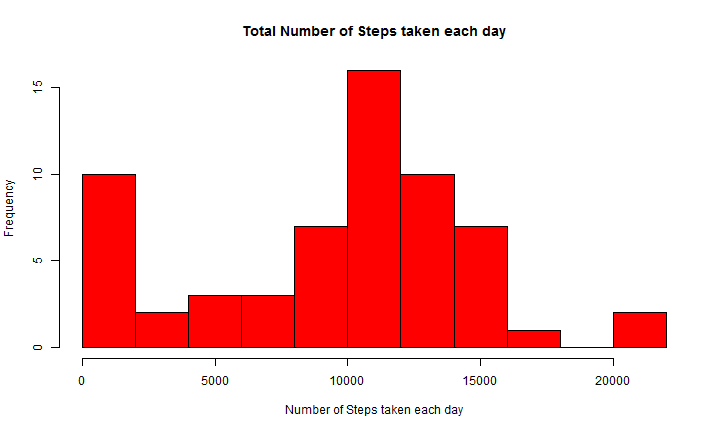
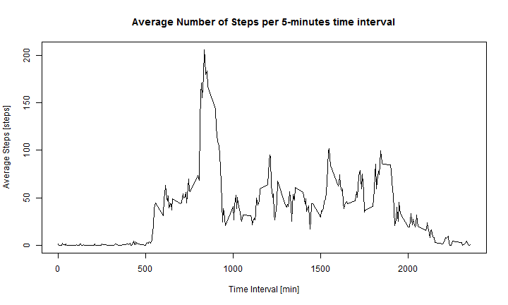
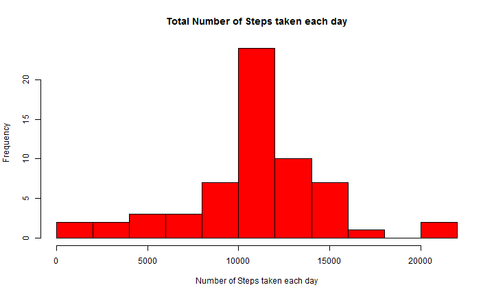
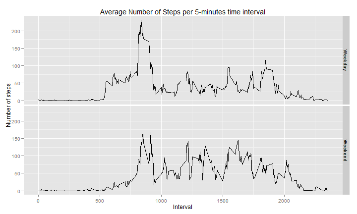

# Reproducible Research: Peer Assessment 1
Author
Rudolf Stolz  
Version 1.0.0  
Date 140609

## Loading and preprocessing the data
---------------------------------------------------------------------------------------------
### Load Library

```r
library(ggplot2)
library(lubridate)
library(plyr)
```

```
## 
## Attaching package: 'plyr'
## 
## Das folgende Objekt ist maskiert from 'package:lubridate':
## 
##     here
```


---------------------------------------------------------------------------------------------
### Load Raw Data
**Note:**  
This File assumes, that the data file activity.zip is stored in the R Working Directory!!!  

```r
activity <- read.csv(unz("activity.zip", "activity.csv"), header = TRUE, sep = ",")
```


## What is mean total number of steps taken per day?
---------------------------------------------------------------------------------------------
### Make a histogram of the total number of steps taken each day  

```r
data.steps.1 <- data.frame(steps = as.numeric(length(unique(activity$date))))
count <- 1
for (i in unique(activity$date)) {
    data.steps.1[count, "steps"] <- sum(activity[activity$date == i & !is.na(activity$steps), 
        "steps"])
    count <- count + 1
}
```


```r
hist(data.steps.1$steps, breaks = 10, col = "red", main = "Total Number of Steps taken each day", 
    xlab = "Number of Steps taken each day")
```

 

---------------------------------------------------------------------------------------------
### Calculate and report the mean and median total number of steps taken per day

```r
summary(data.steps.1)
```

```
##      steps      
##  Min.   :    0  
##  1st Qu.: 6778  
##  Median :10395  
##  Mean   : 9354  
##  3rd Qu.:12811  
##  Max.   :21194
```


## What is the average daily activity pattern?
---------------------------------------------------------------------------------------------
### Make a time series plot (i.e. type = "l") of the 5-minute interval (x-axis) and the average number of steps taken, averaged across all days (y-axis)


```r
data.steps.2 <- data.frame(interval = as.numeric(length(unique(activity$interval))), 
    steps = as.numeric(length(unique(activity$interval))))

count <- 1
for (i in unique(activity$interval)) {
    data.steps.2[count, "interval"] <- i
    data.steps.2[count, "steps"] <- mean(activity[activity$interval == i & !is.na(activity$steps), 
        "steps"])
    count <- count + 1
}
```


```r
plot(x = data.steps.2$interval, y = data.steps.2$steps, type = "l", lty = "solid", 
    lwd = 1, col = "black", main = "Average Number of Steps per 5-minutes time interval", 
    xlab = "Time Interval [min]", ylab = "Average Steps [steps]")
```

 

---------------------------------------------------------------------------------------------
### Which 5-minute interval, on average across all the days in the dataset, contains the maximum number of steps?

```r
max.steps.2 <- max(data.steps.2[, "steps"])
max.interval.2 <- data.steps.2[which.max(data.steps.2[, "steps"]), "interval"]
```

The 5-minute interval **835** contains the maximum average number of 
steps of **206.1698**

## Imputing missing values
---------------------------------------------------------------------------------------------
### Calculate and report the total number of missing values in the dataset (i.e. the total number of rows with NAs)

```r
missing.values <- sum(is.na(activity$steps))
```

The number of missing step values is **2304**

---------------------------------------------------------------------------------------------
### Devise a strategy for filling in all of the missing values in the dataset. The strategy does not need to be sophisticated. For example, you could use the mean/median for that day, or the mean for that 5-minute interval, etc.

**I used the 5-minutes interval average to fill in the missing step values**   
**The required data are available from the calcuation of the last step and stored in data.steps.2**   

```r
## calculate the new data set
activity.new <- activity
for (i in seq(1, nrow(activity.new))) {
    if (is.na(activity.new[i, "steps"])) {
        newvalue <- data.steps.2[data.steps.2$interval == activity.new[i, "interval"], 
            "steps"]
        activity.new[i, "steps"] <- newvalue
    }
}
## calculate the histogram
data.steps.3 <- data.frame(steps = as.numeric(length(unique(activity.new$date))))
count <- 1
for (i in unique(activity.new$date)) {
    data.steps.3[count, "steps"] <- sum(activity.new[activity.new$date == i & 
        !is.na(activity.new$steps), "steps"])
    count <- count + 1
}
```


```r
hist(data.steps.3$steps, breaks = 10, col = "red", main = "Total Number of Steps taken each day", 
    xlab = "Number of Steps taken each day")
```

 

---------------------------------------------------------------------------------------------
### Calculate and report the mean and median total number of steps taken per day

```r
summary(data.steps.3)
```

```
##      steps      
##  Min.   :   41  
##  1st Qu.: 9819  
##  Median :10766  
##  Mean   :10766  
##  3rd Qu.:12811  
##  Max.   :21194
```

---------------------------------------------------------------------------------------------
### Compare the first and the last measurement

```r
compare <- data.frame(summary(data.steps.1), summary(data.steps.3))
names(compare) <- c("col1", "col2", "First Measurement", "col4", "col5", "Last Measurement")
compare[, c(3, 6)]
```

```
##   First Measurement Last Measurement
## 1   Min.   :    0    Min.   :   41  
## 2   1st Qu.: 6778    1st Qu.: 9819  
## 3   Median :10395    Median :10766  
## 4   Mean   : 9354    Mean   :10766  
## 5   3rd Qu.:12811    3rd Qu.:12811  
## 6   Max.   :21194    Max.   :21194
```


## Are there differences in activity patterns between weekdays and weekends?
---------------------------------------------------------------------------------------------
### Create a new factor variable in the dataset with two levels - "weekday" and "weekend" indicating whether a given date is a weekday or weekend day.

```r
## add weekend / weekday data
activity.new$week <- as.factor(activity.new$week <- wday(ymd(activity.new[, 
    "date"])))

activity.new$week <- revalue(activity.new$week, c(`1` = "Weekend", `2` = "Weekday", 
    `3` = "Weekday", `4` = "Weekday", `5` = "Weekday", `6` = "Weekday", `7` = "Weekend"))

## calculate new data set
data.steps.4 <- data.frame(interval = as.numeric(2 * length(unique(activity$interval))), 
    steps = as.numeric(2 * length(unique(activity$interval))), week = as.character(2 * 
        length(unique(activity$interval))), stringsAsFactors = FALSE)
count <- 1
for (i in unique(activity.new$interval)) {
    data.steps.4[count, "interval"] <- i
    data.steps.4[count, "steps"] <- mean(activity.new[activity.new$interval == 
        i & activity.new$week == "Weekday", "steps"])
    data.steps.4[count, "week"] <- "Weekday"
    count <- count + 1
    
    data.steps.4[count, "interval"] <- i
    data.steps.4[count, "steps"] <- mean(activity.new[activity.new$interval == 
        i & activity.new$week == "Weekend", "steps"])
    data.steps.4[count, "week"] <- "Weekend"
    count <- count + 1
}
data.steps.4$week <- as.factor(data.steps.4$week)

str(data.steps.4)
```

```
## 'data.frame':	576 obs. of  3 variables:
##  $ interval: num  0 0 5 5 10 10 15 15 20 20 ...
##  $ steps   : num  2.2512 0.2146 0.4453 0.0425 0.1732 ...
##  $ week    : Factor w/ 2 levels "Weekday","Weekend": 1 2 1 2 1 2 1 2 1 2 ...
```


---------------------------------------------------------------------------------------------
### Make a panel plot containing a time series plot (i.e. type = "l") of the 5-minute interval (x-axis) and the average number of steps taken, averaged across all weekday days or weekend days (y-axis).


```r

ggplot(data = data.steps.4, aes(interval, steps)) + geom_line(stat = "identity") + 
    facet_grid(week ~ .) + labs(x = "Interval") + labs(y = "Number of steps") + 
    labs(title = "Average Number of Steps per 5-minutes time interval")
```

 

```r

```


